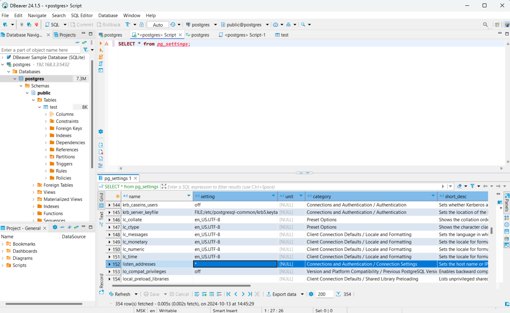

# Домашнее задание. Занятие2. SQL и реляционные СУБД. Введение в PostgreSQL 

## 1. Подготовка стэнда с Postgres

### Подготовка виртуальной машины и установка СУБД

Развернем пока виртуальную машину в VMware Workstation локально на компьютере.
Виртуальная машина была создана со следующими параметрами:
* CPU: 2vCPU
* RAM: 4 ГБ
* Диск: HDD, 30 ГБ
* ОС: Ubuntu 24.04 LTS

После создания ВМ ставим на нее Postgres 15.
```
dimon@pg-stand-01:~$ sudo apt-get update
dimon@pg-stand-01:~$ sudo apt-get upgrade
dimon@pg-stand-01:~$ sudo apt-get install postgresql-15 postgresql-contrib
```

### Настройка Postgres

настройки для подключений с других хостов из DBMS типа Dbeaver/PGadmin

1. Разрешить PostgreSQL слушать подключения с любых адресов, а не только с `localhost`. Это настраивается в файле конфигурации `postgresql.conf`:
```
dimon@pg-stand-01:~$ sudo nano /etc/postgresql/15/main/postgresql.conf
```
```
#------------------------------------------------------------------------------
# CONNECTIONS AND AUTHENTICATION
#------------------------------------------------------------------------------
# - Connection Settings -
listen_addresses = '*'                  # устанавливаем парметр listen_addreses = '*' для возможности подключения извне
                                 
```

2. Разрешаем всем пользователям подключаться к Postgres из сети 192.168.3.0/24 по ipv4  в файле конфигурации `pg_hba.conf`:
```
dimon@pg-stand-01:~$ sudo nano /etc/postgresql/15/main/pg_hba.conf
```
```
# TYPE  DATABASE        USER            ADDRESS                 METHOD
host    all             all             192.168.3.0/24          scram-sha-256

```

3. Назначаем пользоваелю "postgres" пароль в СУБД для внешних подключений
```
dimon@pg-stand-01:~$ sudo su - postres psql
postgres=# alter user postgres with password 'blablablamegastrongapass';
postgres=# exit
postgres@pg-stand-01:~$ exit
dimon@pg-stand-01:~$
```

4. Перезапускаем службу postgresql, чтобы параметр listen_addresses применился
```
dimon@pg-stand-01:~$ sudo service postgresql restart
```

5. Подключаемся к СУБД через DBeaver

DBeaver подключенный к СУБД</img>

### Подключение к БД, инициализация данных

Создаем БД otus-test
```sql
postgres=# create database "otus-test";
postgres=# \c "otus-test";
You are now connected to database "otus-test" as user "postgres".
otus-test=#
```

## 2. Опыты с уровнями изоляции транзакций

### Параллельные запросы с уровнем изоляции `read committed`

Настроим приглашение в сессиях для удобства идентификации сессий
```
\set PROMPT1 '[session-1] %R%x%# '
\set PROMPT1 '[session-2] %R%x%# '
```

Отключим в первой сессии автокоммит транзакций, создадим таблицу и заполним её тестовыми данными:
```sql
[session-1] =# \set AUTOCOMMIT off
[session-1] =# \c otus-test
You are now connected to database "otus-test" as user "postgres".
[session-1] =#  create table persons(id serial, first_name text, second_name text);
CREATE TABLE
[session-1] =*# insert into persons(first_name, second_name) values('ivan', 'ivanov');
INSERT 0 1
[session-1] =*# insert into persons(first_name, second_name) values('petr', 'petrov');
INSERT 0 1
[session-1] =*# commit;
COMMIT;
[session-1] =#
```
Проверяем уровень изоляции транзакций в обеих тестовых сессиях
```sql
[session-1] =# show transaction isolation level;
otus-test-# ;
 transaction_isolation
-----------------------
 read committed
(1 row)

[session-2] =# show transaction isolation level;
 transaction_isolation
-----------------------
 read committed
(1 row)
```

Проверим, что эти данные действительно доступны во второй сессии, и заодно отключим автокоммит:
```sql
[session-2] =# \set AUTOCOMMIT off
[session-2] =# select * from persons;
 id | first_name | last_name
----+------------+-----------
  1 | Ivan       | Ivanov
  2 | Petr       | Petrov
(2 rows)

[session-2] =*#
```
> **Интересная деталь**: судя по приглашению, выполнение `select` неявно начало новую транзакцию, несмотря на то, что практического смысла в этом при уровне изоляции `read committed` немного. Видимо, это особенность поведения `psql` при отключенном `AUTOCOMMIT`.

Вернёмся в первую сессию, вставим в таблицу ещё одну строку, а затем попробуем её прочитать во второй сессии:
```sql
[session-1] =# insert into persons (first_name, last_name) values ('Sergey', 'Sergeev');
INSERT 0 1
[session-1] =*# select * from persons;
 id | first_name | last_name
----+------------+-----------
  1 | Ivan       | Ivanov
  2 | Petr       | Petrov
  3 | Sergey     | Sergeev
(3 rows)
```
```sql
[session-2] =*# select * from persons;
 id | first_name | last_name
----+------------+-----------
  1 | Ivan       | Ivanov
  2 | Petr       | Petrov
(2 rows)
```
Как видно, во второй сессии новая строка, вставленная в первой сессии, не видна. Причина в том, что уровень изоляции `read committed`, как видно из названия, разрешает транзакциям читать [только данные, которые были успешно сохранены](https://www.postgresql.org/docs/14/transaction-iso.html#XACT-READ-COMMITTED). Это значит, что изменения, сделанные в какой-то транзакции, станут видны в рамках других активных транзакций только после того, как внёсшая их транзакция завершится `commit`-ом. В данном же случае транзакция в первой сессии не завершена, и поэтому строка, которая в ней была добавлена, не видна во второй сессии.

Теперь попробуем сохранить изменения:
```sql
[session-1] =*# commit;
COMMIT
[session-1] =# 
```
```sql
[session-2] =*# select * from persons;
 id | first_name | last_name
----+------------+-----------
  1 | Ivan       | Ivanov
  2 | Petr       | Petrov
  3 | Sergey     | Sergeev
(3 rows)
```
Мы видим, что теперь, когда транзакция в первой сессии завершилась, сделанные в ней изменения стали видны во второй транзакции, даже несмотря на то, что транзакция во второй сессии всё ещё не завершена. Это поведение также полностью согласуется с описанным выше поведением при уровне изоляции `read committed` - изменения, сделанные в рамках первой транзакции, будут видны в рамках других транзакций, даже если эти изменения были сохранены уже после начала этих других транзакций. Однако поведение, когда один и тот же запрос в рамках одной и той же транзакции (в нашем случае - транзакции в сессии 2) может возвращать разные данные (из-за того, что данные могут параллельно изменяться и сохраняться другими транзакциями - в нашем случае транзакцией в сессии 1), иногда не является желаемым, и его порой называют *проблемой фантомного чтения* (англ. *phantom read anomaly*).

> **Примечание**: в программе домашнего задания этого не было, но здесь можно было бы привести пример похожей проблемы - *проблемы неповторяющегося чтения* (англ. *nonrepeatable read anomaly*). Она могла бы возникнуть примерно так:
> 1. И первая, и вторая сессия начинают транзакцию;
> 2. Первая сессия вносит изменения в какую-либо строку (`update persons set last_name = 'Petrovskiy' where id = 2;`);
> 3. Вторая сессия читает данные из таблицы (`select * from persons where id = 2;`) и не видит внесённых изменений;
> 4. Первая сессия завершает транзакцию и сохраняет изменения (`commit;`);
> 5. Вторая сессия повторно читает данные (`select * from persons where id = 2;`), и прочитанное состояние строки на этот раз отличается от состояния на шаге 3, несмотря на то, что транзакция во второй сессии всё ещё не завершена.
> 
> Такое дополнение помогло бы плавно перевести тему к уровню `repeatable read`, который, судя по названию, призван решить именно эту проблему.

### Параллельные запросы с уровнем изоляции `repeatable read`

Попробуем проделать тот же опыт, но с более строгим уровнем изоляции - `repeatable read`:
```sql
[session-1] =# set transaction isolation level repeatable read;
SET
[session-1] =*# insert into persons (first_name, last_name) values ('Sveta', 'Svetova');
INSERT 0 1
[session-1] =*# select * from persons;
 id | first_name | last_name
----+------------+-----------
  1 | Ivan       | Ivanov
  2 | Petr       | Petrov
  3 | Sergey     | Sergeev
  4 | Sveta      | Svetova
(4 rows)
```
```sql
[session-2] =# set transaction isolation level repeatable read;
SET
[session-2] =*# select * from persons;
 id | first_name | last_name
----+------------+-----------
  1 | Ivan       | Ivanov
  2 | Petr       | Petrov
  3 | Sergey     | Sergeev
(3 rows)
```
Как и в прошлый раз, изменения, сделанные в несохранённой транзакции в первой сессии, во второй сессии не видны. Попробуем их сохранить:
```sql
[session-1] =*# commit;
COMMIT
[session-1] =#
```
```sql
[session-2] =*# select * from persons;
 id | first_name | last_name
----+------------+-----------
  1 | Ivan       | Ivanov
  2 | Petr       | Petrov
  3 | Sergey     | Sergeev
(3 rows)
```
Как видно, проблема фантомного чтения решена - изменения из первой сессии не видны во второй сессии, даже несмотря на то, что они были сохранены (например, если прямо сейчас начнётся третья сессия, то в ней эти изменения будут уже видны). Это поведение является ключевой особенностью [уровня изоляции `repeatable read`](https://www.postgresql.org/docs/14/transaction-iso.html#XACT-REPEATABLE-READ) - каждая транзакция видит данные точно в том состоянии, в каком они были *на момент начала* читающей транзакции (в отличие от уровня `read committed`, при котором транзакция всегда видит *текущие* сохранённые данные, вне зависимости от того, когда именно они были сохранены относительно начала читающей транзакции).
> **Примечание**: насколько я понял из [описания уровней изоляции ANSI в википедии](https://en.wikipedia.org/wiki/Isolation_(database_systems)), "каноничная" реализация уровня изоляции `repeatable read` обязана защищать только от неповторяющегося чтения (когда набор строк, возвращаемых запросом, остаётся тем же, но значения полей в этих строках изменяются параллельными транзакциями), но вовсе не обязана защищать от фантомного чтения (когда в результате действий параллельных транзакций меняется сам набор строк - то, что мы имитировали в этом задании). То, что механизм MVCC в PostgreSQL помогает избавиться и от фантомного чтения тоже - всего лишь приятный бонус, но полагаться на это в других СУБД опасно.

Теперь попробуем завершить вторую транзакцию:
```sql
[session-2] =*# commit;
COMMIT
[session-2] =# select * from persons;
 id | first_name | last_name
----+------------+-----------
  1 | Ivan       | Ivanov
  2 | Petr       | Petrov
  3 | Sergey     | Sergeev
  4 | Sveta      | Svetova
(4 rows)

[session-2] =*#
```
Теперь, когда транзакция завершена, ограничения на видимую версию строк таблицы `persons` сняты, и вторая сессия снова может видеть текущее состояние этой таблицы (или любой другой таблицы в той же БД).
> **Интересная деталь**: можно ещё раз обратить внимание на то, что после выполнения `select` в приглашении `psql` снова появилась звёздочка. Это значит, что при использовании `psql` с отключенным `AUTOCOMMIT` чтение данных запустит новую транзакцию, и версия видимых данных снова будет заморожена.
