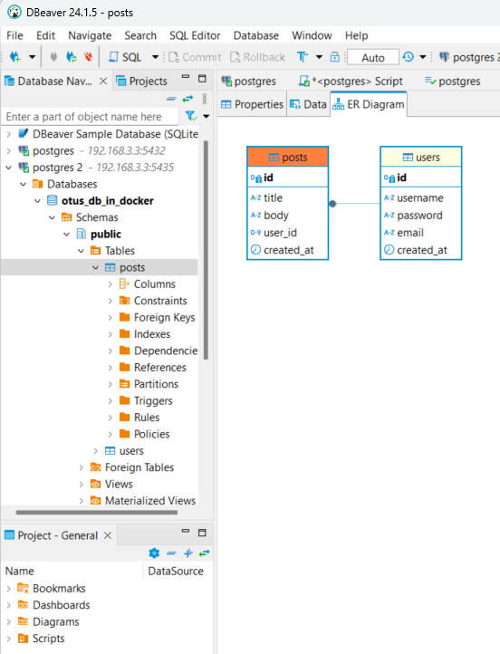

# Установка PostgreSQL

## Подготовка Docker

Использум ВМ из [предыдущего домашнего задания](../2-lesson/2-lesson-1.md#подготовка-виртуальной-машины-и-установка-субд).

Устанавливаем DockerEngine по [инструкции по установке из apt-репозитория](https://docs.docker.com/engine/install/ubuntu/#install-using-the-repository)

**Add Docker's official GPG key:**
``` shell

dimon@pg-stand-01:~$sudo apt-get update
dimon@pg-stand-01:~$sudo apt-get install ca-certificates curl
dimon@pg-stand-01:~$sudo install -m 0755 -d /etc/apt/keyrings
dimon@pg-stand-01:~$sudo curl -fsSL https://download.docker.com/linux/ubuntu/gpg -o /etc/apt/keyrings/docker.asc
dimon@pg-stand-01:~$sudo chmod a+r /etc/apt/keyrings/docker.asc
```

Добавляем apt-репозитоий с пакетами докер
``` bash
echo \
  "deb [arch=$(dpkg --print-architecture) signed-by=/etc/apt/keyrings/docker.asc] https://download.docker.com/linux/ubuntu \
  $(. /etc/os-release && echo "$VERSION_CODENAME") stable" | \
  sudo tee /etc/apt/sources.list.d/docker.list > /dev/null

```

Ставим последнюю версию пакетов докер

``` bash
dimon@pg-stand-01:~$sudo apt-get update
dimon@pg-stand-01:~$sudo apt-get install docker-ce docker-ce-cli containerd.io docker-buildx-plugin docker-compose-plugin
```

Проверим корректность установки Docker на примере образа Hello-World

``` bash
dimon@pg-stand-01:~$sudo docker run hello-world
Unable to find image 'hello-world:latest' locally
latest: Pulling from library/hello-world
c1ec31eb5944: Pull complete
Digest: sha256:d211f485f2dd1dee407a80973c8f129f00d54604d2c90732e8e320e5038a0348
Status: Downloaded newer image for hello-world:latest

Hello from Docker!
This message shows that your installation appears to be working correctly.

To generate this message, Docker took the following steps:
 1. The Docker client contacted the Docker daemon.
 2. The Docker daemon pulled the "hello-world" image from the Docker Hub.
    (amd64)
 3. The Docker daemon created a new container from that image which runs the
    executable that produces the output you are currently reading.
 4. The Docker daemon streamed that output to the Docker client, which sent it
    to your terminal.

To try something more ambitious, you can run an Ubuntu container with:
 $ docker run -it ubuntu bash
```
## Запуск контейнера с PostgreSQL

Создадим директорию для PostgreSQL в контейнере:
```bash
dimon@pg-stand-01:~$ sudo mkdir /var/lib/postgresql15-docker
dimon@pg-stand-01:~$ ls -la /var/lib/postgres*
/var/lib/postgres15-docker:
total 8
drwxr-xr-x  2 root root 4096 Oct 13 14:40 .
drwxr-xr-x 49 root root 4096 Oct 13 14:40 ..

/var/lib/postgresql:
total 20
drwxr-xr-x  3 postgres postgres 4096 Aug 20 19:51 .
drwxr-xr-x 49 root     root     4096 Oct 13 14:40 ..
drwxr-xr-x  3 postgres postgres 4096 Aug 19 10:56 15
-rw-------  1 postgres postgres   31 Aug 20 19:51 .lesshst
-rw-------  1 postgres postgres  561 Oct 13 13:36 .psql_history
```
**Создадим виртуальную сеть postgres-net для контейнеров**
``` bash
dimon@pg-stand-01:~$ sudo docker network create postgres-net
444dbb75c686e6dc39c6aa645e8918e32929e138107ebd119fd7c0d34dd25b14
```
**Запустим контейнер с сервером PostgreSQL 15**
``` bash
dimon@pg-stand-01:~$ sudo docker run --name postgres-15 --network postgres-net -e POSTGRES_PASSWORD=postgres -p 5435:5432 -v /var/lib/postgresql15-docker:/var/lib/postgresql/data -d postgres:15

Unable to find image 'postgres:15' locally
15: Pulling from library/postgres
302e3ee49805: Pull complete
5ccfe0637e34: Pull complete
2a43a85981e6: Pull complete
1c01c9d4aa53: Pull complete
40ebb982f2b6: Pull complete
ff52dc352d37: Pull complete
f0e0cd0717bd: Pull complete
57434856e21c: Pull complete
bd0553b56125: Pull complete
ee25c60ee352: Pull complete
1f2d3a46d356: Pull complete
e64a076b3fdd: Pull complete
dfe36a78fbfa: Pull complete
be71cbe065b5: Pull complete
Digest: sha256:8e97b8526ed19304b144f7478bc9201646acf0723cdc100e9bb7495712cbadb6
Status: Downloaded newer image for postgres:15
df34ee61d0df4fcb0187a074eb48e57ab3401ad125d5504d0cd3022473cf27de
```
**Описание параметров**
* -p 5435:5432 порт 5435 хоста (так как порт 5432 на хосте занят предыдущей инсталяцией PostgreSQL) связываем с портом 5432 внутри контейнера.
* -v локальная директория `/var/lib/postgresql15-docker` монтируется внутрь контейнера в директорию `/var/lib/postgresql/data`
* --name - имя контейнера
* --network postgres-net - выбираем для запускаемого контейнера ранее созданную виртуальную сеть

## Подключение к кластеру PG внутри контейнера
`dimon@pg-stand-01:~$ sudo docker run --network postgres-net --name pg15-client --rm -it postgres:15 psql -h postgres-15 -U postgres`
**Описание параметров**
* --network postgres-net - выбираем для запускаемого контейнера ранее созданную виртуальную сеть
* --name pg15-client - имя контейнера
* --rm - автоматически удалять контейнер и связанные с ним тома при выходе из него
*  -it - интерактивное подключение контейнеру с выводом TTY, далее идут команды передоваемые в консоль контейнера
  а именно psql c параметрами подключения к Postgres

Подключение после создания контейнера:
``` bash
dimon@pg-stand-01:~$ sudo docker exec -it pg15-client bash
root@896632d58611:/# psql -h postgres-15 -U postgres
Password for user postgres:
psql (15.8 (Debian 15.8-1.pgdg120+1))
Type "help" for help.

postgres=# \conninfo
You are connected to database "postgres" as user "postgres" on host "postgres-15" (address "172.18.0.2") at port "5432".

```
Создание тестовой базы в psql, наполнение ее тестовыми данными

``` sql
postgres=# create database otus_db_in_docker;
\c otus_db_in_docker;

postgres=# create database otus_db_in_docker;
CREATE DATABASE
postgres=#\c otus_db_in_docker;
postgres=# CREATE TABLE users (
  id SERIAL PRIMARY KEY,
  username VARCHAR(50) NOT NULL,
  password VARCHAR(50) NOT NULL,
  email VARCHAR(50) UNIQUE  NOT NULL,
  created_at DATE DEFAULT CURRENT_TIMESTAMP
);

CREATE TABLE posts (
  id SERIAL PRIMARY KEY,
  title VARCHAR(100)  NOT NULL,
  body TEXT NOT NULL,
  user_id INT NOT NULL,
  FOREIGN KEY (user_id) REFERENCES users(id),
  created_at DATE DEFAULT CURRENT_TIMESTAMP
);


INSERT INTO users (username, password, email ) VALUES
 ('John Doe', 'password', 'John@Doe.com'),
  ('Jane Doe', 'password', 'Jane Doe'),
  ('John Smith', 'password', 'John@Smith.com');

INSERT INTO posts (title, body, user_id) VALUES
 ('Post 1', 'This is the first post', 1),
  ('Post 2', 'This is the second post', 2),
   ('Post 3', 'This is the third post', 3);
CREATE TABLE

CREATE TABLE
INSERT 0 3
INSERT 0 3
postgres=# SELECT * from users;
 id |  username  | password |     email      | created_at

----+------------+----------+----------------+------------
  1 | John Doe   | password | John@Doe.com   | 2024-10-13
  2 | Jane Doe   | password | Jane Doe       | 2024-10-13
  3 | John Smith | password | John@Smith.com | 2024-10-13
(3 rows)
```
**Подключаемся через DBeaver с другого компьютера, работает**
подключен к СУБД внутри контейнера "postgres-15"</img>

## Удаление контейнера с СУБД, сохраняя данные кластера PostgreSQL 15
Смотрим что дата-директория кластера в контейнера сохранилась в   `/var/lib/postgresql15-docker` на хостовой машине
``` bash
dimon@pg-stand-01:~$ sudo ls -la /var/lib/postgresql15-docker
total 136
drwx------ 19  999 root             4096 Oct 13 14:53 .
drwxr-xr-x 50 root root             4096 Oct 13 14:53 ..
drwx------  6  999 systemd-journal  4096 Oct 13 16:09 base
drwx------  2  999 systemd-journal  4096 Oct 13 14:55 global
drwx------  2  999 systemd-journal  4096 Oct 13 14:53 pg_commit_ts
drwx------  2  999 systemd-journal  4096 Oct 13 14:53 pg_dynshmem
-rw-------  1  999 systemd-journal  4821 Oct 13 14:53 pg_hba.conf
-rw-------  1  999 systemd-journal  1636 Oct 13 14:53 pg_ident.conf
drwx------  4  999 systemd-journal  4096 Oct 13 16:28 pg_logical
drwx------  4  999 systemd-journal  4096 Oct 13 14:53 pg_multixact
drwx------  2  999 systemd-journal  4096 Oct 13 14:53 pg_notify
drwx------  2  999 systemd-journal  4096 Oct 13 14:53 pg_replslot
drwx------  2  999 systemd-journal  4096 Oct 13 14:53 pg_serial
drwx------  2  999 systemd-journal  4096 Oct 13 14:53 pg_snapshots
drwx------  2  999 systemd-journal  4096 Oct 13 14:53 pg_stat
drwx------  2  999 systemd-journal  4096 Oct 13 14:53 pg_stat_tmp
drwx------  2  999 systemd-journal  4096 Oct 13 14:53 pg_subtrans
drwx------  2  999 systemd-journal  4096 Oct 13 14:53 pg_tblspc
drwx------  2  999 systemd-journal  4096 Oct 13 14:53 pg_twophase
-rw-------  1  999 systemd-journal     3 Oct 13 14:53 PG_VERSION
drwx------  3  999 systemd-journal  4096 Oct 13 14:53 pg_wal
drwx------  2  999 systemd-journal  4096 Oct 13 14:53 pg_xact
-rw-------  1  999 systemd-journal    88 Oct 13 14:53 postgresql.auto.conf
-rw-------  1  999 systemd-journal 29517 Oct 13 14:53 postgresql.conf
-rw-------  1  999 systemd-journal    36 Oct 13 14:53 postmaster.opts
-rw-------  1  999 systemd-journal    94 Oct 13 14:53 postmaster.pid
```

Пробуем удалить контейнер с сервером PostgreSQL 15

``` bash
dimon@pg-stand-01:~$sudo docker stop postgres-15
postgres-15
dimon@pg-stand-01:~$sudo docker rm postgres-15
postgres-15
```
Проверяем с хост-машины подключение, чтобы убедится что оно не доступно: 
``` bash
dimon@pg-stand-01:~$ psql -h localhost -p 5435 -U postgres
psql: error: connection to server at "localhost" (127.0.0.1), port 5435 failed: Connection refused
        Is the server running on that host and accepting TCP/IP connections?
```
Итак, контейнер удален и не доступен к подключениям.
Пересоздаем его с теми же параметрами:

``` bash
dimon@pg-stand-01:~$ sudo docker run --name postgres-15 --network postgres-net -e POSTGRES_PASSWORD=postgres -p 5435:5432 -v /var/lib/postgresql15-docker:/var/lib/postgresql/data -d postgres:15
e79e51e0ffd487755ec087bcbf0e40869e5b22fba1ce225d2f4007ef0ad011fd
```
Пробуем подключится с хостовой машины

``` bash
dimon@pg-stand-01:~$ psql -h localhost -p 5435 -U postgres
Password for user postgres:
psql (15.8 (Ubuntu 15.8-1.pgdg24.04+1))
Type "help" for help.

postgres=# \l
                                                    List of databases
       Name        |  Owner   | Encoding |  Collate   |   Ctype    | ICU Locale | Locale Provider |   Access privileges
-------------------+----------+----------+------------+------------+------------+-----------------+-----------------------
 otus_db_in_docker | postgres | UTF8     | en_US.utf8 | en_US.utf8 |            | libc            |
 postgres          | postgres | UTF8     | en_US.utf8 | en_US.utf8 |            | libc            |
 template0         | postgres | UTF8     | en_US.utf8 | en_US.utf8 |            | libc            | =c/postgres          +
                   |          |          |            |            |            |                 | postgres=CTc/postgres
 template1         | postgres | UTF8     | en_US.utf8 | en_US.utf8 |            | libc            | =c/postgres          +
                   |          |          |            |            |            |                 | postgres=CTc/postgres
(4 rows)

postgres=# \c otus_db_in_docker
You are now connected to database "otus_db_in_docker" as user "postgres".
otus_db_in_docker=# \d
              List of relations
 Schema |     Name     |   Type   |  Owner
--------+--------------+----------+----------
 public | posts        | table    | postgres
 public | posts_id_seq | sequence | postgres
 public | users        | table    | postgres
 public | users_id_seq | sequence | postgres
(4 rows)

otus_db_in_docker=# select * from users;
 id |  username  | password |     email      | created_at
----+------------+----------+----------------+------------
  1 | John Doe   | password | John@Doe.com   | 2024-10-13
  2 | Jane Doe   | password | Jane Doe       | 2024-10-13
  3 | John Smith | password | John@Smith.com | 2024-10-13
(3 rows)
```
**УСПЕХ!!!**

Пробуем подключится с другого компьютера при помощи DBeaver
подключен к СУБД внутри контейнера "postgres-15"</img>

Вывод: Данные кластера успешно сохранились, так как хранились не внутри контейнера а на хостовой машине в папке `/var/lib/postgresql15-docker` примонтированной в контейнер в дата-директорию кластера Postgres `/var/lib/postgresql/data`

