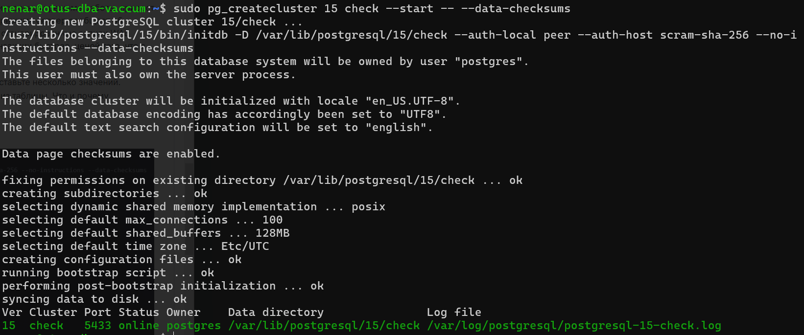

# Занятие 9. Журналы
## Подготовка ВМ
Используем ВМ в YC из [предыдущего занятия ](../8-lesson/8-lesson.md) 
## Изменение периодичности чекпойнтов

``` bash
nenar@otus-dba-vaccum:~$ sudo nano /etc/postgresql/15/main/postgresql.conf

#------------------------------------------------------------------------------
# WRITE-AHEAD LOG
#------------------------------------------------------------------------------
# - Settings -
# - Checkpoints -

checkpoint_timeout = 30s                # range 30s-1d
```
Перезапустим кластер 15/main для применения изменений `sudo pg_ctlcluster 15 main restart`
Инициализируем pgbench для базы postgres

  ``` bash
  nenar@otus-dba-vaccum:~$ pgbench -h localhost -p 5432 -U postgres -i postgres
  Password:
  dropping old tables...
  NOTICE:  table "pgbench_accounts" does not exist, skipping
  NOTICE:  table "pgbench_branches" does not exist, skipping
  NOTICE:  table "pgbench_history" does not exist, skipping
  NOTICE:  table "pgbench_tellers" does not exist, skipping
  creating tables...
  generating data (client-side)...
  100000 of 100000 tuples (100%) done (elapsed 0.03 s, remaining 0.00 s)
  vacuuming...
  creating primary keys...
  done in 0.47 s (drop tables 0.02 s, create tables 0.05 s, client-side generate 0.15 s, vacuum 0.11 s, primary keys 0.14 s).
  ```
  Теперь можно запускать бэнчмарки.
  
  ## Измерьте, какой объем журнальных файлов был сгенерирован за это время. Оцените, какой объем приходится в среднем на одну контрольную точку.

  ### Воспользуемся также статистикой из системного представления `pg_stat_bgwriter`
  ```
  nenar@otus-dba-vaccum:~$ sudo -u postgres psql
  Password for user postgres:
  psql (15.8 (Ubuntu 15.8-1.pgdg24.04+1))
  Type "help" for help.

  postgres=#  select * from pg_stat_bgwriter \gx
  -[ RECORD 1 ]---------+------------------------------
  checkpoints_timed     | 61
  checkpoints_req       | 1
  checkpoint_write_time | 27699
  checkpoint_sync_time  | 22
  buffers_checkpoint    | 1719
  buffers_clean         | 0
  maxwritten_clean      | 0
  buffers_backend       | 1691
  buffers_backend_fsync | 0
  buffers_alloc         | 1873
  stats_reset           | 2024-10-16 09:21:04.037855+00
  ```
### Посмотрим теущее положение в буфере WAL
```
select pg_current_wal_insert_lsn(), pg_current_wal_lsn(), pg_current_wal_flush_lsn();
postgres=# select pg_current_wal_insert_lsn(), pg_current_wal_lsn(), pg_current_wal_flush_lsn();
pg_current_wal_insert_lsn | pg_current_wal_lsn | pg_current_wal_flush_lsn
---------------------------+--------------------+--------------------------
0/70E1220                 | 0/70E1220          | 0/70E1220
(1 row)
```
Значения pg_current_wal_insert_lsn() - положение вставки в WAL, pg_current_wal_lsn()- положение последней записи, отданной для записи ОС, pg_current_wal_flush_lsn() -положение последней записи сохраненной на диск совпадают. В базе нет данных несохраненных в WAL, из-за отсутсвия активности нагрузки.

### Запускаем тест pgbench на 600 секунд, 10 клиентов, вывод статистики каждые 40 сек
```
nenar@otus-dba-vaccum:~$ pgbench -h localhost -p 5432 -U postgres -c 8 -P 40 -T 600 postgres
Password:
pgbench (15.8 (Ubuntu 15.8-1.pgdg24.04+1))
starting vacuum...end.
progress: 40.0 s, 364.2 tps, lat 21.875 ms stddev 20.152, 0 failed
progress: 80.0 s, 432.8 tps, lat 18.486 ms stddev 17.521, 0 failed
progress: 120.0 s, 386.4 tps, lat 20.718 ms stddev 21.458, 0 failed
progress: 160.0 s, 422.2 tps, lat 18.944 ms stddev 18.629, 0 failed
progress: 200.0 s, 411.5 tps, lat 19.411 ms stddev 18.239, 0 failed
progress: 240.0 s, 382.5 tps, lat 20.926 ms stddev 19.892, 0 failed
progress: 280.0 s, 477.1 tps, lat 16.762 ms stddev 15.736, 0 failed
progress: 320.0 s, 400.5 tps, lat 19.967 ms stddev 18.570, 0 failed
progress: 360.0 s, 392.8 tps, lat 20.366 ms stddev 19.890, 0 failed
progress: 400.0 s, 464.5 tps, lat 17.222 ms stddev 15.854, 0 failed
progress: 440.0 s, 394.7 tps, lat 20.234 ms stddev 19.736, 0 failed
progress: 480.0 s, 415.6 tps, lat 19.270 ms stddev 18.700, 0 failed
progress: 520.0 s, 418.4 tps, lat 19.116 ms stddev 17.651, 0 failed
progress: 560.0 s, 372.3 tps, lat 21.468 ms stddev 20.084, 0 failed
progress: 600.0 s, 351.0 tps, lat 22.800 ms stddev 22.934, 0 failed
transaction type: <builtin: TPC-B (sort of)>
scaling factor: 1
query mode: simple
number of clients: 8
number of threads: 1
maximum number of tries: 1
duration: 600 s
number of transactions actually processed: 243469
number of failed transactions: 0 (0.000%)
latency average = 19.707 ms
latency stddev = 19.020 ms
initial connection time = 100.764 ms
tps = 405.828238 (without initial connection time)
```
### Смотрим статистику bgwriter
```
nenar@otus-dba-vaccum:~$ sudo -u postgres psql
could not change directory to "/home/nenar": Permission denied
Password for user postgres:
psql (15.8 (Ubuntu 15.8-1.pgdg24.04+1))
Type "help" for help.

postgres=# select * from pg_stat_bgwriter \gx
-[ RECORD 1 ]---------+------------------------------
checkpoints_timed     | 135
checkpoints_req       | 1
checkpoint_write_time | 593087
checkpoint_sync_time  | 440
buffers_checkpoint    | 42612
buffers_clean         | 0
maxwritten_clean      | 0
buffers_backend       | 3414
buffers_backend_fsync | 0
buffers_alloc         | 3922
stats_reset           | 2024-10-16 09:21:04.037855+00

postgres=# select pg_current_wal_insert_lsn(), pg_current_wal_lsn(), pg_current_wal_flush_lsn();
 pg_current_wal_insert_lsn | pg_current_wal_lsn | pg_current_wal_flush_lsn
 pg_current_wal_insert_lsn | pg_current_wal_lsn | pg_current_wal_flush_lsn
---------------------------+--------------------+--------------------------
 0/205D3E70                | 0/205D3E70         | 0/205D3E70
(1 row)

postgres-#
```
Посмотрим разницу между lsn до `0/70E1220 ` и после теста `0/205D3E70`
``` sql
postgres=# select pg_wal_lsn_diff('0/205D3E70','0/70E1220');
 pg_wal_lsn_diff
-----------------
       424619088
(1 row)

postgres=# select pg_size_pretty(pg_wal_lsn_diff('0/205D3E70','0/70E1220'));
 pg_size_pretty
----------------
 405 MB
(1 row)
```
***На одну контрольную точку таким образом приходится 405/20= 20,25 МБ***
### Проверьте данные статистики: все ли контрольные точки выполнялись точно по расписанию. Почему так произошло?
Судя по логам, контрольные точки выполнялись по ~27 секунд и пропусков запуска я в логах не увидел, то есть чекпоинты
успевали сделатся до запуска следующего, но если нагрузка была немного повыше или диск медленне, то запаса в 3 секунды до следующего чекпойнта уже не хватило бы.
```
nenar@otus-dba-vaccum:~$ sudo tail -n 60 /var/log/postgresql/postgresql-15-main.log | grep checkpoint
2024-10-16 10:16:19.044 UTC [1455] LOG:  checkpoint complete: wrote 1746 buffers (1.3%); 0 WAL file(s) added, 0 removed, 1 recycled; write=26.872 s, sync=0.022 s, total=26.919 s; sync files=18, longest=0.015 s, average=0.002 s; distance=19415 kB, estimate=19415 kB
2024-10-16 10:16:22.047 UTC [1455] LOG:  checkpoint starting: time
2024-10-16 10:16:49.046 UTC [1455] LOG:  checkpoint complete: wrote 1981 buffers (1.5%); 0 WAL file(s) added, 0 removed, 1 recycled; write=26.932 s, sync=0.013 s, total=27.000 s; sync files=18, longest=0.006 s, average=0.001 s; distance=20403 kB, estimate=20403 kB
2024-10-16 10:16:52.048 UTC [1455] LOG:  checkpoint starting: time
2024-10-16 10:17:19.018 UTC [1455] LOG:  checkpoint complete: wrote 1929 buffers (1.5%); 0 WAL file(s) added, 0 removed, 1 recycled; write=26.914 s, sync=0.010 s, total=26.970 s; sync files=17, longest=0.007 s, average=0.001 s; distance=20007 kB, estimate=20363 kB
2024-10-16 10:17:22.021 UTC [1455] LOG:  checkpoint starting: time
2024-10-16 10:17:49.085 UTC [1455] LOG:  checkpoint complete: wrote 1931 buffers (1.5%); 0 WAL file(s) added, 0 removed, 1 recycled; write=27.006 s, sync=0.035 s, total=27.064 s; sync files=9, longest=0.015 s, average=0.004 s; distance=19960 kB, estimate=20323 kB
2024-10-16 10:17:52.089 UTC [1455] LOG:  checkpoint starting: time
2024-10-16 10:18:19.045 UTC [1455] LOG:  checkpoint complete: wrote 2012 buffers (1.5%); 0 WAL file(s) added, 0 removed, 2 recycled; write=26.871 s, sync=0.015 s, total=26.957 s; sync files=21, longest=0.008 s, average=0.001 s; distance=21147 kB, estimate=21147 kB
2024-10-16 10:18:22.048 UTC [1455] LOG:  checkpoint starting: time
2024-10-16 10:18:49.110 UTC [1455] LOG:  checkpoint complete: wrote 1949 buffers (1.5%); 0 WAL file(s) added, 0 removed, 1 recycled; write=26.991 s, sync=0.010 s, total=27.062 s; sync files=10, longest=0.006 s, average=0.001 s; distance=20847 kB, estimate=21117 kB
2024-10-16 10:18:52.112 UTC [1455] LOG:  checkpoint starting: time
2024-10-16 10:19:19.122 UTC [1455] LOG:  checkpoint complete: wrote 1956 buffers (1.5%); 0 WAL file(s) added, 0 removed, 1 recycled; write=26.887 s, sync=0.048 s, total=27.010 s; sync files=21, longest=0.025 s, average=0.003 s; distance=20329 kB, estimate=21039 kB
2024-10-16 10:19:22.125 UTC [1455] LOG:  checkpoint starting: time
2024-10-16 10:19:49.110 UTC [1455] LOG:  checkpoint complete: wrote 1968 buffers (1.5%); 0 WAL file(s) added, 0 removed, 2 recycled; write=26.891 s, sync=0.028 s, total=26.986 s; sync files=9, longest=0.018 s, average=0.004 s; distance=20773 kB, estimate=21012 kB
2024-10-16 10:19:52.113 UTC [1455] LOG:  checkpoint starting: time
2024-10-16 10:20:19.074 UTC [1455] LOG:  checkpoint complete: wrote 2005 buffers (1.5%); 0 WAL file(s) added, 0 removed, 1 recycled; write=26.875 s, sync=0.013 s, total=26.962 s; sync files=20, longest=0.012 s, average=0.001 s; distance=20909 kB, estimate=21002 kB
2024-10-16 10:20:22.077 UTC [1455] LOG:  checkpoint starting: time
2024-10-16 10:20:49.116 UTC [1455] LOG:  checkpoint complete: wrote 1911 buffers (1.5%); 0 WAL file(s) added, 0 removed, 1 recycled; write=26.976 s, sync=0.011 s, total=27.039 s; sync files=10, longest=0.006 s, average=0.002 s; distance=19443 kB, estimate=20846 kB
2024-10-16 10:20:52.119 UTC [1455] LOG:  checkpoint starting: time
2024-10-16 10:21:19.061 UTC [1455] LOG:  checkpoint complete: wrote 1995 buffers (1.5%); 0 WAL file(s) added, 0 removed, 1 recycled; write=26.878 s, sync=0.010 s, total=26.943 s; sync files=21, longest=0.010 s, average=0.001 s; distance=20244 kB, estimate=20786 kB
2024-10-16 10:21:22.065 UTC [1455] LOG:  checkpoint starting: time
2024-10-16 10:21:49.061 UTC [1455] LOG:  checkpoint complete: wrote 1894 buffers (1.4%); 0 WAL file(s) added, 0 removed, 1 recycled; write=26.965 s, sync=0.019 s, total=26.997 s; sync files=8, longest=0.014 s, average=0.003 s; distance=20123 kB, estimate=20719 kB
2024-10-16 10:21:52.064 UTC [1455] LOG:  checkpoint starting: time
2024-10-16 10:22:19.113 UTC [1455] LOG:  checkpoint complete: wrote 2035 buffers (1.6%); 0 WAL file(s) added, 0 removed, 2 recycled; write=27.008 s, sync=0.007 s, total=27.049 s; sync files=19, longest=0.006 s, average=0.001 s; distance=20612 kB, estimate=20709 kB
2024-10-16 10:22:22.116 UTC [1455] LOG:  checkpoint starting: time
2024-10-16 10:22:49.071 UTC [1455] LOG:  checkpoint complete: wrote 1871 buffers (1.4%); 0 WAL file(s) added, 0 removed, 1 recycled; write=26.877 s, sync=0.033 s, total=26.956 s; sync files=8, longest=0.019 s, average=0.005 s; distance=19781 kB, estimate=20616 kB
2024-10-16 10:22:52.074 UTC [1455] LOG:  checkpoint starting: time
2024-10-16 10:23:19.047 UTC [1455] LOG:  checkpoint complete: wrote 2173 buffers (1.7%); 0 WAL file(s) added, 0 removed, 1 recycled; write=26.875 s, sync=0.019 s, total=26.973 s; sync files=19, longest=0.019 s, average=0.001 s; distance=19977 kB, estimate=20552 kB
2024-10-16 10:23:22.050 UTC [1455] LOG:  checkpoint starting: time
2024-10-16 10:23:49.108 UTC [1455] LOG:  checkpoint complete: wrote 1913 buffers (1.5%); 0 WAL file(s) added, 0 removed, 1 recycled; write=26.967 s, sync=0.032 s, total=27.059 s; sync files=11, longest=0.021 s, average=0.003 s; distance=19758 kB, estimate=20473 kB
2024-10-16 10:23:52.111 UTC [1455] LOG:  checkpoint starting: time
2024-10-16 10:24:19.066 UTC [1455] LOG:  checkpoint complete: wrote 1987 buffers (1.5%); 0 WAL file(s) added, 0 removed, 2 recycled; write=26.874 s, sync=0.007 s, total=26.955 s; sync files=15, longest=0.007 s, average=0.001 s; distance=19791 kB, estimate=20405 kB
2024-10-16 10:24:22.069 UTC [1455] LOG:  checkpoint starting: time
2024-10-16 10:24:49.119 UTC [1455] LOG:  checkpoint complete: wrote 1839 buffers (1.4%); 0 WAL file(s) added, 0 removed, 1 recycled; write=26.974 s, sync=0.021 s, total=27.050 s; sync files=9, longest=0.014 s, average=0.003 s; distance=19027 kB, estimate=20267 kB
2024-10-16 10:24:52.122 UTC [1455] LOG:  checkpoint starting: time
2024-10-16 10:25:19.088 UTC [1455] LOG:  checkpoint complete: wrote 2056 buffers (1.6%); 0 WAL file(s) added, 0 removed, 1 recycled; write=26.898 s, sync=0.015 s, total=26.967 s; sync files=19, longest=0.015 s, average=0.001 s; distance=18660 kB, estimate=20106 kB
2024-10-16 10:25:52.122 UTC [1455] LOG:  checkpoint starting: time
2024-10-16 10:26:19.043 UTC [1455] LOG:  checkpoint complete: wrote 1872 buffers (1.4%); 0 WAL file(s) added, 0 removed, 1 recycled; write=26.888 s, sync=0.008 s, total=26.922 s; sync files=17, longest=0.007 s, average=0.001 s; distance=16685 kB, estimate=19764 kB
2024-10-16 11:45:50.125 UTC [996] LOG:  checkpoint starting: end-of-recovery immediate wait
2024-10-16 11:45:50.169 UTC [996] LOG:  checkpoint complete: wrote 3 buffers (0.0%); 0 WAL file(s) added, 0 removed, 0 recycled; write=0.008 s, sync=0.002 s, total=0.079 s; sync files=2, longest=0.001 s, average=0.001 s; distance=0 kB, estimate=0 kB
```
***Логи  подтверждают то, что на каждый чекпойнт (контрольную точку) приходится около 20 МБ WAL***

### Сравните tps в синхронном/асинхронном режиме утилитой pgbench. Объясните полученный результат.
Проверяем режим коммита. ***Он включен***
```
postgres=# show synchronous_commit;
 synchronous_commit
--------------------
 on
(1 row)

```
Запускаем тест в синхронном режиме
```
nenar@otus-dba-vaccum:~$ pgbench -c 8 -P 10 -T 60 -U postgres postgres
Password:
pgbench (15.8 (Ubuntu 15.8-1.pgdg24.04+1))
starting vacuum...end.
progress: 10.0 s, 317.1 tps, lat 25.021 ms stddev 25.003, 0 failed
progress: 20.0 s, 411.0 tps, lat 19.456 ms stddev 20.217, 0 failed
progress: 30.0 s, 316.2 tps, lat 25.279 ms stddev 22.452, 0 failed
progress: 40.0 s, 369.1 tps, lat 21.682 ms stddev 19.321, 0 failed
progress: 50.0 s, 371.5 tps, lat 21.519 ms stddev 21.472, 0 failed
progress: 60.0 s, 375.6 tps, lat 21.327 ms stddev 22.647, 0 failed
transaction type: <builtin: TPC-B (sort of)>
scaling factor: 1
query mode: simple
number of clients: 8
number of threads: 1
maximum number of tries: 1
duration: 60 s
number of transactions actually processed: 21613
number of failed transactions: 0 (0.000%)
latency average = 22.190 ms
latency stddev = 21.901 ms
initial connection time = 72.635 ms
tps = 360.415766 (without initial connection time)
```
**Получили среднее значение TPS=360**

**Меняем режим коммита на ассинхронный**
```
postgres=# ALTER SYSTEM SET synchronous_commit = off;
ALTER SYSTEM
postgres=# select pg_reload_conf();
 pg_reload_conf
----------------
 t
(1 row)

postgres=# show synchronous_commit;
 synchronous_commit
--------------------
 off
(1 row)

```
**Запускаем тест в асинхронном режиме коммита**

```
nenar@otus-dba-vaccum:~$ pgbench -c 8 -P 10 -T 60 -U postgres postgres
Password:
pgbench (15.8 (Ubuntu 15.8-1.pgdg24.04+1))
starting vacuum...end.
progress: 10.0 s, 2843.3 tps, lat 2.791 ms stddev 1.376, 0 failed
progress: 20.0 s, 2866.4 tps, lat 2.789 ms stddev 1.393, 0 failed
progress: 30.0 s, 2886.3 tps, lat 2.770 ms stddev 1.369, 0 failed
progress: 40.0 s, 2893.3 tps, lat 2.763 ms stddev 1.380, 0 failed
progress: 50.0 s, 2898.2 tps, lat 2.758 ms stddev 1.371, 0 failed
progress: 60.0 s, 2925.0 tps, lat 2.733 ms stddev 1.359, 0 failed
transaction type: <builtin: TPC-B (sort of)>
scaling factor: 1
query mode: simple
number of clients: 8
number of threads: 1
maximum number of tries: 1
duration: 60 s
number of transactions actually processed: 173133
number of failed transactions: 0 (0.000%)
latency average = 2.767 ms
latency stddev = 1.376 ms
initial connection time = 69.092 ms
tps = 2888.260440 (without initial connection time)
```
**Получили среднее значение TPS=2888**
>Вывод: TPS после включения асинхронного режима коммита вырос значительно, более чем в 8 раз
>это происходит т.к. в синхронном режиме данные отправляются на диск во время коммита транзакции.
>В режиме асинхронного подтверждения сервер сообщает об успешном завершении сразу, как только транзакция
>будет завершена логически, прежде чем сгенерированные записи WAL фактически будут записаны на диск.
>Если во время окна риска между асинхронным подтверждением транзакции и сохранением на диск записей WAL,
>происходит крах СУБД, то изменения, сделанные во время этой транзакции будут потеряны. Продолжительность окна
>риска ограничена, потому что фоновый процесс `WAL writer`, сохраняет не записанные записи WAL на диск каждые
>`wal_writer_delay` миллисекунд. Фактически, максимальная продолжительность окна риска составляет трёхкратное значение
>`wal_writer_dela`y, потому что WAL writer разработан так, чтобы сразу сохранять целые страницы во время периодов занятости.

### Создайте новый кластер с включенной контрольной суммой страниц. Создайте таблицу. Вставьте несколько значений. Выключите кластер. Измените пару байт в таблице. Включите кластер и сделайте выборку из таблицы. Что и почему произошло? как проигнорировать ошибку и продолжить работу?

СОЗДАЕМ КЛАСТЕР СО ВКЛЮЧЕННЫМ CHECKSUM с названием "check"</img>
